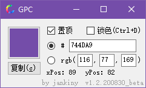
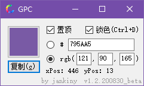
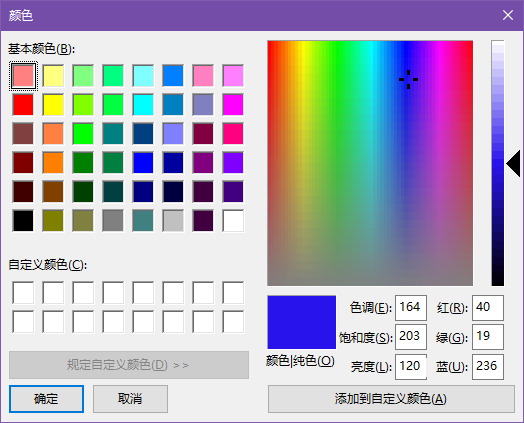
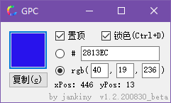

# PixelColor
## 1 项目说明

下载：[Release页面](https://github.com/jankiny/PixelColor/releases)

简介：一个获取鼠标位置像素点的颜色的小软件（类似拾色器），具有以下功能

-   在全局进行[拾色](###2.1 拾色功能（锁色）)，并通过全局热键`Ctrl+D`[锁色](###2.1 拾色功能（锁色）)（可能会出现热键冲突；之后可能会加入<u>"设置"</u>可自定义热键）
-   锁定颜色后，可[复制](###2.2 复制颜色)`HTML颜色代码`或`RGB代码`
-   [调色](###2.3 调色)功能，调色完成后也可复制`HTML颜色代码`或`RGB代码`

## 2 详细说明

### 2.1 拾色功能（锁色）

打开软件会自动勾选<u>"置顶"</u>，因此鼠标可以点击其他窗口进行拾色。获取到需要的颜色后，按`Ctrl+D`键，会勾选<u>锁色</u>，之后不再获取颜色。

### 2.2 复制颜色

锁色后可以选择`html样式`或`rgb样式`，之后点<u>复制</u>按钮，会复制到剪切板。

>   
>   #795AA5
>   rgb(121,90,165)

### 2.3 调色

打开点击<u>”复制“</u>按钮上方的按钮，打开调色板，打开调色是会自动勾选<u>“锁色”</u>，调色板是`winfom的颜色对话框`，确定后即可获得颜色的`html和rgb颜色串`

